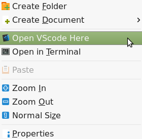
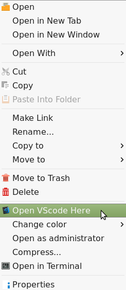

# Content

- [Content](#content)
- [Description](#description)
- [Prerequisites](#prerequisites)
    - [Visual Studio Code](#visual-studio-code)
    - [Caja](#caja)
    - [Caja-python](#caja-python)
    - [Caja-pyextensions](#caja-pyextensions)
- [Compatibility](#compatibility)
- [To do list](#to-do-list)


# Description

This caja extension allows to open vscode on current directory just through the right-clicking.





# Prerequisites

## Visual Studio Code

The simplest way to install VS code is to download and install the package from [VS code official website](https://code.visualstudio.com/#alt-downloads)

## Caja

Caja is default file manager for mate desktop environment. If not installed yet, run
```console
$ sudo apt-get install caja
```

## Caja-python

One can install caja-python through running the following command
```console
$ sudo apt-get install caja-python
```

## Caja-pyextensions

Caja-pyextensions can be easily installed by one line command
```console
$ sudo apt-get install caja-pyextensions
```

alternatively, one can download and install the package from the [link](http://www.giuspen.com/software/caja-pyextensions_3.4.1-1_all.deb)

If the link is broken, refer to
https://www.giuspen.com/nautilus-pyextensions/

# Compatibility

This program only has been tested in Linux Mint 18.3. But it should work in any OS installed with Caja.

# To do list

- [ ] add installation guide
- [ ] add more description